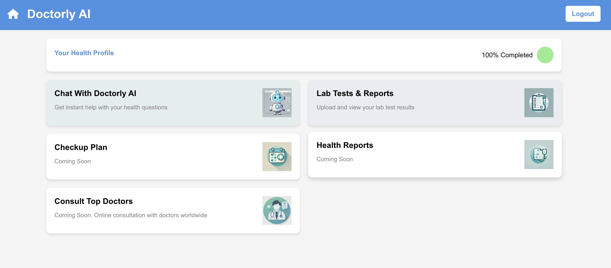
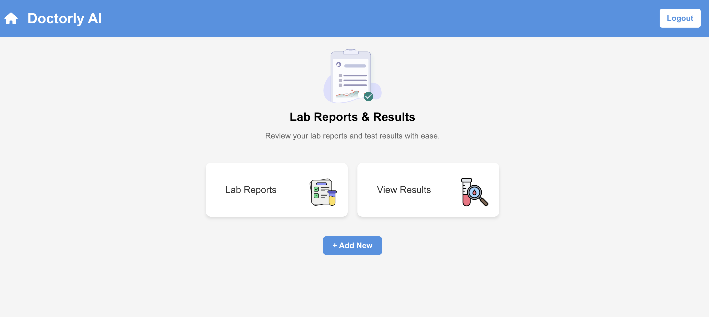
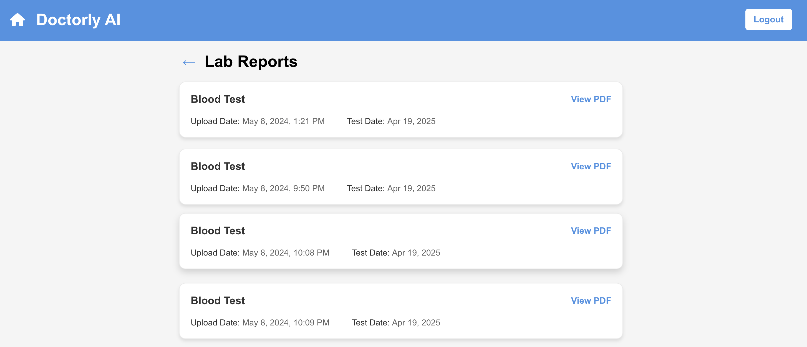
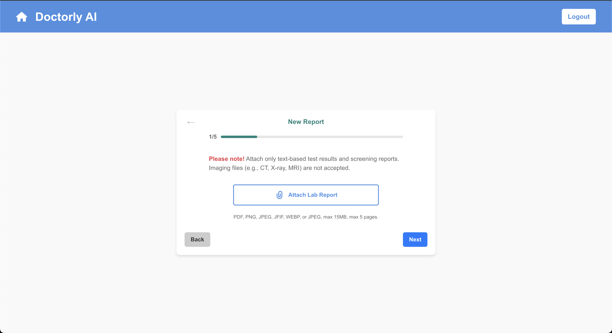
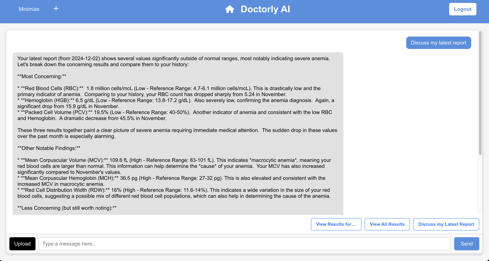
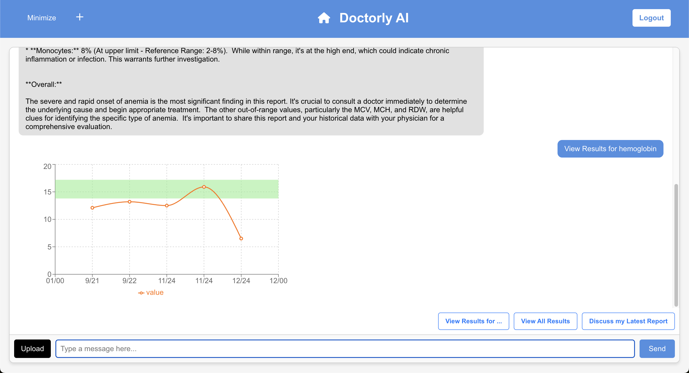
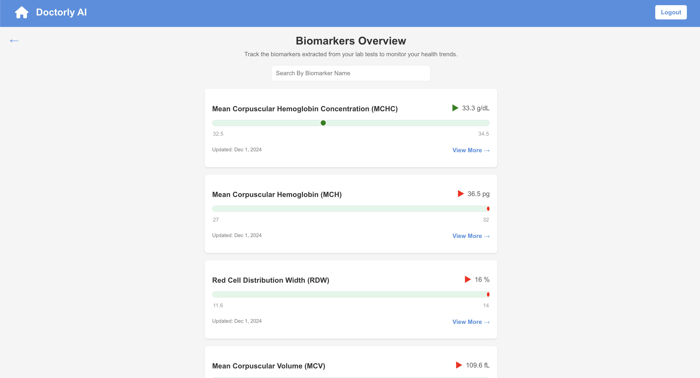
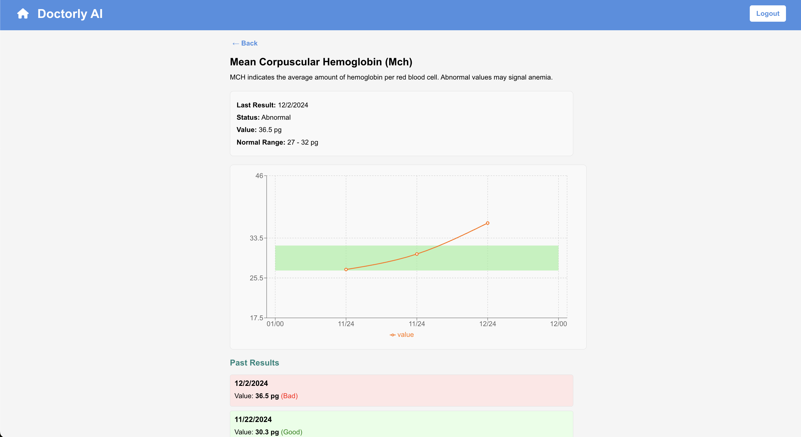

# Doctorly AI: RAG-Enabled LLM Medical Report Analysis System

This project automates the extraction, processing, and visualization of biomarker data from lab test reports. Leveraging cutting-edge technologies like fine-tuned large language models and an interactive web interface, the system bridges the gap between raw medical data and actionable health insights.

[Read the Full Report (PDF)](./Report.pdf)

---

## Demo Screenshots

<div align="center">
  
  
  
  
  
  
  
  
</div>

---

## Features

### **1. Automated Biomarker Parsing**
- Extracts biomarker data such as `Hemoglobin`, `White Blood Cells`, `Platelets`, and more from structured PDF reports.
- Maps test results against reference ranges for each biomarker.

### **2. Fine-Tuned Meta LLaMA Integration**
- Meta’s **LLaMA 8B model** is fine-tuned with:
  - **Medical Reports**: For contextual understanding of test results.
  - **Doctor-Patient Conversations**: To emulate personalized and empathetic insights.
  - **Clinical Guidelines**: To align recommendations with medical best practices.
- Powers advanced features like:
  - Predictive health analysis.
  - Early warning for abnormal trends.
  - Personalized recommendations for lifestyle adjustments and follow-up tests.

### **3. Interactive Web Interface**
- Provides an intuitive dashboard for users to:
  - View the most recent biomarker values.
  - Analyze trends with dynamic visualizations.
  - Compare test results against ideal ranges with color-coded indicators (green, yellow, red).
- Includes search and filtering capabilities for quick access to key data.

### **4. Historical Data Tracking**
- Stores historical biomarker data for each user.
- Enables users to track health trends over time.
- Facilitates comparative analysis to observe changes over months or years.

### **6. Insights Dashboard**
- Combines interactive charts with AI-driven insights to empower users and healthcare providers.
- Highlights key health trends and areas requiring attention.

---

## Technology Stack
### **AI/ML**
- **Meta’s LLaMA 8B**:
  - Fine-tuned on a medical dataset to provide health insights tailored to user data.
  - Analyzes biomarker trends for predictive analysis and personalized recommendations.

### **Frontend**
- **React.js**: For building a dynamic and responsive user interface.
- **Recharts**: For rendering biomarker trend charts with real-time updates.

### **Backend**
- **Node.js + Express.js**: For building scalable REST APIs.
- **MongoDB**: For storing user-specific biomarker data and medical reports.

### **Parsing**
- **pdf-parse**: Extracts structured text from PDF reports.
- **Regex**: Identifies and formats biomarker data from raw text.

---

## Workflow

1. **Upload**:
   - Users upload a PDF blood report via the web interface.

2. **Parsing**:
   - The system extracts biomarker data using `pdf-parse` and validates it against `biomarkers.json`.

3. **Database Entry**:
   - Parsed data is structured and sent to the backend for storage.

4. **Visualization**:
   - Users view biomarker trends through interactive charts.
   - Color-coded indicators provide quick insights into whether values fall within the normal range.

5. **AI Insights**:
   - Fine-tuned Meta’s LLaMA processes historical and most recent biomarker data to:
     - Offer predictions for long-term health outcomes.
     - Highlight abnormal patterns with actionable recommendations.

---

## Example Use Cases

- **For Patients**:
  - Monitor key health indicators over time.
  - Receive AI-generated recommendations for improving specific biomarkers.

- **For Healthcare Providers**:
  - Access detailed patient biomarker trends for diagnosis.
  - Use AI-driven insights for proactive treatment planning.

- **For Researchers**:
  - Aggregate anonymized data for population health studies.
  - Analyze trends across various demographics.

---

## Future Plans

- **Enhanced Parsing**:
  - Add support for image-based PDFs using OCR (e.g., Tesseract.js).
  - Handle non-standard report formats dynamically.

- **Predictive Health Modeling**:
  - Extend LLaMA’s fine-tuning to predict long-term health risks.

- **Integration with Wearables**:
  - Sync data from fitness trackers and smartwatches to provide a holistic view of health.

- **Mobile App**:
  - Expand the platform to mobile devices for real-time health tracking.

---

## Vision

This project aims to empower users with clear, actionable insights from their medical data. By combining robust parsing capabilities, interactive visualizations, and the power of fine-tuned AI, we make health monitoring intuitive, proactive, and impactful.

---

## Running the Code

1. **Clone the Repository**  
   Clone the repository and navigate into it:
   ```bash
   git clone https://github.com/your-repo-url/rag-medical-reports.git](https://github.com/Vinzeee/RAG-LLM-Medical-Reports.git)
   cd RAG-LLM-Medical-Reports/
   ```

2. **Install Dependencies**  
   Navigate to /client and /server directories and install dependencies
   ```bash
   npm install
   ```

3. **Start frontend and backend**  
   Navigate to /client and /server directories and run the start script
   ```bash
   npm run start
   ```

4. **Setup Environment variables**  
   Need to create .env file in server to contain MongoDB, AWS S3, and JWT tokens.
   ```bash
   MONGODB_URI=<your-mongo-uri>
   AWS_ACCESS_KEY_ID=<your-aws-access-key-id>
   AWS_SECRET_ACCESS_KEY=<your-aws-secret-access-key>
   AWS_REGION=<your-aws-region>
   JWTPRIVATEKEY=<your-jwt-secret-key>
   ```

5. **Access the Application**  
   Enjoy at: https://localhost:3000
